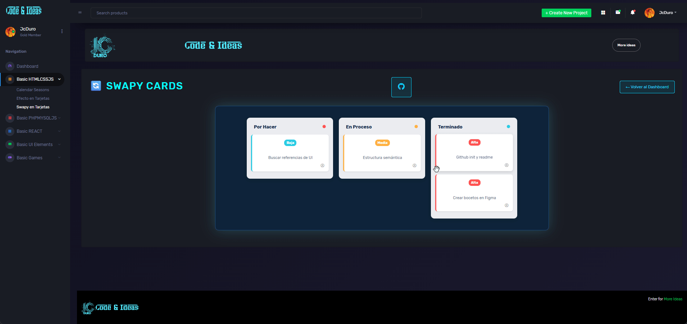

## 📋 TaskFlow - Board Interactivo con SortableJs

> Un tablero de gestión de tareas dinámico con funcionalidad Drag & Drop, diseño responsivo y persistencia de datos.

---

## 🖼️ Vista previa

--- 

## ✨ Pruebalo Online

[Sortable_cards](https://jcduro.bexartideas.com/proyectos/dashjc/sort_cards/sortable.php)

--- 

## 🚀 Descripción

Este proyecto es una aplicación web tipo **Kanban** (similar a Trello) que permite organizar tareas en diferentes estados: "Por hacer", "En proceso" y "Terminado". 

El objetivo principal fue implementar una interfaz de usuario moderna y fluida, separando la lógica de negocio (`sortable.js`) de la estructura visual, y utilizando el almacenamiento local del navegador para que los datos no se pierdan al recargar.

## ✨ Características Principales

* **Drag & Drop Fluido:** Implementado con la librería **SortableJS** para una experiencia de usuario suave en escritorio y móvil.
* **Persistencia de Datos:** Uso de `localStorage` para guardar el estado y posición exacta de las tarjetas automáticamente.
* **Diseño Responsivo:** Se adapta a pantallas de móviles y tablets usando Flexbox y unidades relativas.
* **UI Moderna:** Estilos visuales con Glassmorphism, variables CSS y tipografías limpias.
* **Código Modular:** Separación de preocupaciones (SoC) dividiendo HTML, CSS y JS.

---

## 📊 Lenguajes y Herramientas

---

## 🙋‍♂️ Autor
Desarrollado por JcDuro
© 2025 JcDuro - Code & Ideas

--- 

## 📄 Licencia
Libre, usalo como quieras

  Hecho con 💙 y neones

---

## ⭐ Si te gustó este proyecto, no olvides dejar una estrella en GitHub!
